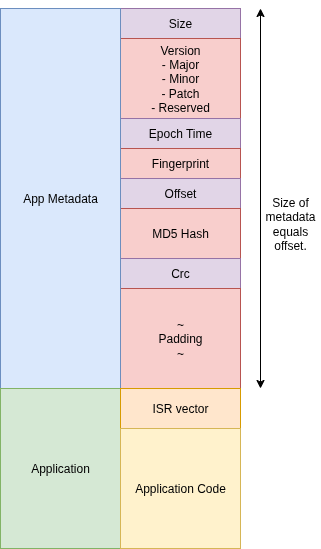

### Architecture

This program is used to package application binaries for integrity checks performed by the bootloader. It creates a packaged file containing the metadata and application, enabling the bootloader to verify the application's integrity before execution.



### Usage

```
$ ./pak -h
Options:
  -h   Show this help message
  -i   Input file path                  (required)
  -o   Output file path                 (required)
  -m   Major version number             (required)
  -n   Minor version number             (required)
  -p   Patch version number             (required)
  -t   Offset of the application binary (required)
  -f   Fingerprint of the app builder   (optional, default is 0)

```

### Example

```
./pak -m 1 -n 0 -p 0 -i uds_application_server.bin -t 256 -o uds_application_server.pak -f 123
```